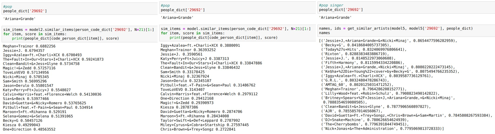
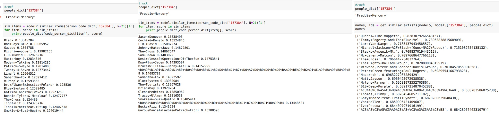
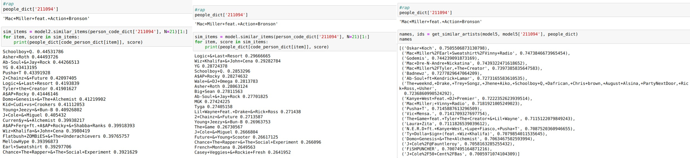

# 30Music-artist-recommendation

## Dataset
[30Music Dataset](http://recsys.deib.polimi.it/datasets/)

## Repository organisation

* Data preparation: [data_preparation.ipynb](data_preparation.ipynb)

* Baseline model - collaborative filtering for implicit feedback datasets: [collaborative_filtering.ipynb](collaborative_filtering.ipynb)

* Stronger model - item2vec embeddings: [item2vec.ipynb](item2vec.ipynb)

* Comparison of the two models: [methods_quality_comparison](methods_quality_comparison.ipynb)

* Prepared data for training, validation and testing: [data](data/)

* Helper functions used in the notebooks: [utils](utils/)

## Process description
1. Я подготовила данные: перешла от истории прослушиваний треков к истории прослушиваний исполнителей. Процесс можно посмотреть в ноутбуке 
[data_preparation.ipynb](data_preparation.ipynb).

2. Я решила разбить данные на Train и Test по пользователям - 80% пользователей я оставила в трейне, остальные оказались в тестовом датасете. 
Я разделила данные таким образом, потому что было бы хорошо построить модель, способную рекоммендовать испольнителей новым юзерам, то есть тем, кого не было в трейнинг сете (с этим есть проблемы у коллаборативной фильтрации). В качестве сета для валидации я решила использовать hit rate и left-one-out технику. Для каждого юзера из трейнинг сета я удалила по одному исполнителю, с которым этот юзер взаимодействовал (слушал его треки), и составила из этих пар юзер-исполнитель left-one-out сет. Таким образом, я пыталась рекоммендовать топ-20 лучших исполнителей и если среди этих 20 для каждого юзера был тот, которого я отбросила, я считала это за hit. Поделив на количество юзеров, получала hit rate.  Таким образом, можно оценить, может ли модель порекоммендовать исполнителя, которого даный юзер на самом деле слушал, но которого не было в трейнинг сете.

Я использовала hit rate скор, чтобы выбрать лучшую модель при тьюнинге гиперпараметров, а потом делала предсказания на тест сете, используя модель с лучшими параметрами. Затем, я делала эвалюэйшн уже на тест сете - считала precision, recall и MAPk.

3. В качестве бейзлайн модели я выбрала **коллаборативную фильтрацию** (CF). В качестве более сложной модели я натренировала **item2vec** эмбеддинги с помощью gensim word2vec.

#### Collaborative filtering for implicit feedback datasets

Я выбрала коллаборативную фильтрацию, так как это один из самых популярных методов для построения рекоммендательных систем. Он дает неплохие результаты, и натренировать модель почти не занимает времени. Так как задача была найти векторные представления для исполнителей, такие, чтобы можно было находить похожих исполнителей, например, с помощью кластеризации, я использовала коллаборативную фильтрацию, чтобы извлечь item factors и посмотреть, насколько они применимы для того, чтобы искать похожих исполнителей. 

   В данном случае, у нас нет рейтингов исполнителей или еще каких-то оценок, данных пользователями, и тд., то есть это данные типа implicit feedback. Я применяла метод, описанный в статье [Collaborative Filtering for Implicit Feedback Datasets](http://yifanhu.net/PUB/cf.pdf). Этот метод реализован в библиотеке [implicit](https://github.com/benfred/implicit), которая очень удобна в использовании и имеет хорошую документацию. Чтобы получить векторные представления исполнителей, я составила матрицу user-artist, в которой значением на пересечении строки юзера и столбца исполнителя является количество прослушиваний данного исполнителя юзером. Я применила Alterating Least Squares, чтобы получить разложение матрицы. Таким образом, я получила 2 матрицы - вектора юзеров и исполнителей. 

   Я натренировала три CF модели с разными параметрами, чтобы для каждой посчитать hit rate и тем самым оценить, какая из них лучше. Для всех моделей hit rate оказался нулевым. Думаю, это связано с тем, как работает матричное разложение. Скорее всего в топе оказывались те исполнители, с которыми юзер контактировал согласно трейнинг сету, а новые исполнители оказывались в конце. Возможно надо было переписать функцию вычисления hit rate так, чтобы она оценивала те топ-20 рекомендованных исполнителей, с которым пользователь не контактировал в трейнинг сете.  

Далее я выбрала одну из версий векторов и использовала их для рекоммендации на тест сете. Так как в тест сете у нас находятся юзеры, которых модель не видела, а у коллаборейтив фильтеринга с этим проблемы, я решила использовать усредненный вектор исполнителей, которых слушал юзер из тест сета, чтобы по этому вектору находить наиболее близкие к нему вектора исполнителей и рекомендовать их юзеру. Для этого я использовала cosine similarity. Таким образом, мы рекоммендуем новому пользователю исполнителей, которые похожи на набор исполнителей, которых он прослушал до этого. 

Чтобы оценить перформанс модели, я предсказала для каждого юзера из тест сета 20 лучших исполнителей, используя описанный выше метод, и сравнила предсказания с тем, что юзер на самом деле слушал. Для сравнения я использовала метрики MAPk (mean average precision at k), precision и recall, так как это наиболее популярные метрики для top-N рекоммендательных систем.

#### item2vec embeddings

В качестве второй модели я решила натренировать [item2vec](https://arxiv.org/vc/arxiv/papers/1603/1603.04259v2.pdf) эмбеддинги используя word2vec из gensim. Word2vec модели показали себя очень хорошо в NLP, они дают отличные результаты для построения векторных представлений слов. Я решила, что это должно сработать и для того, чтобы искать похожих исполнителей, и использовала последовательности из id исполнителей в порядке их прослушивания для каждого юзера из трейнинг сета вместо предложений в обычном word2vec. Так, исполнители, которые часто встречаются вместе, должны иметь похожие вектора. 

Я натренировала несколько word2vec моделей с разными параметрами и для каждой посчитала hit rate на left-one-out датасете. Я выбрала для проверки на тест сете две модели - лучшую по hit rate и вторую лучшую по hit rate.

Я использовала эти модели для рекоммендаций на тест сете, и опять же, посчитала MAPk, precision и recall. Для рекоммендаций я использовала тот же способ, что и для CF (брала усредненный вектор, полученный из векторов прослушанных исполнителей, и использовала cosine similarity, чтобы найти top-20 похожих). По MAPk, precision и recall, вторая по hit rate модель оказалась лучше. Видимо, использование hit rate для валидации было все-таки не лучшей идеей:)

4. Сравнение моделей и статистическая значимость полученных результатов

Я сравнила средние MAPk, precision, recall для CF и item2vec моделей. Также я сравнила распределения MAPk, precision и recall, полученных для каждого юзера в тест сете. Для сравнения я использовала Mann-Whitney U test, так как он позволяет оценить различия между двумя выборками. Оказалось, что согласно MAPk, recall и precision, collaborative filtering работает лучше для задачи Artist Recommendation чем item2vec.

Также я сравнила топ-20 похожих исполнителей, полученных с помощью этих двух моделей, для трех исполнителей:

* Ariana Grande (CF vs item2vec)

* Freddie Mercury (CF vs item2vec)

* Mac Miller feat. Action Bronson (CF vs item2vec)

Если сравнивать топ-20 исполнителей, полученных с помощью CF и item2vec (human evaluation), то мне кажется, что item2vec работает лучше. 

То есть, для рекоммендаций с помощью описанного выше метода, лучше работает CF модель. Но для нахождения похожих исполнителей лучше работает item2vec.

##### Что хотелось бы доделать?

* Придумать другой способ валидации, чтобы сравнивать модели, натренированные с разными параметрами (не hit rate)

* Автоматизировать hyperpatameter tuning

* Попробовать использовать файл relations/love.idomaar (насколько я понимаю, там указано, какие треки пользователь лайкнул). По идее, информация о том, какие треки понравились юзеру, могла бы улучшить качество рекоммендаций.

